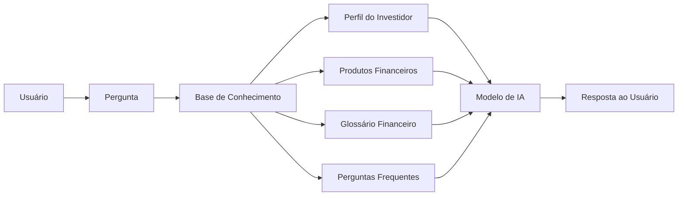

# 🤖 Agente Financeiro Inteligente com IA Generativa

## Contexto

Os assistentes virtuais no setor financeiro estão evoluindo de simples chatbots reativos para **agentes inteligentes e proativos**. Neste desafio, você vai idealizar e prototipar um agente financeiro que utiliza IA Generativa para:

- **Antecipar necessidades** ao invés de apenas responder perguntas
- **Personalizar** sugestões com base no contexto de cada cliente
- **Cocriar soluções** financeiras de forma consultiva
- **Garantir segurança** e confiabilidade nas respostas (anti-alucinação)

> [!TIP]
> Na pasta [`examples/`](./examples/) você encontra referências de implementação para cada etapa deste desafio.

---

## O Que Você Deve Entregar

### 1. Documentação do Agente

O **InvestSmart AI** é um assistente virtual desenvolvido para auxiliar investidores iniciantes na compreensão dos principais conceitos do mercado financeiro. Utilizando Inteligência Artificial e uma base de conhecimento estruturada, o agente fornece respostas claras, educativas e confiáveis sobre investimentos, sempre priorizando a transparência e evitando recomendações financeiras personalizadas.

- **Caso de Uso:** O **InvestSmart AI** é um assistente virtual de educação financeira que auxilia investidores iniciantes a compreender conceitos sobre investimentos, perfil de risco e planejamento financeiro. Seu objetivo é fornecer informações claras e educativas, sem realizar recomendações de compra ou venda de ativos.
- **Persona e Tom de Voz:** O agente se comunica de forma clara, objetiva e acessível, utilizando linguagem simples para facilitar o entendimento de usuários iniciantes. Sempre mantém um tom profissional, imparcial e educativo.
- **Arquitetura:** O usuário faz uma pergunta, que é analisada pelo agente. Em seguida, a IA consulta a base de conhecimento, utiliza essas informações como contexto e gera uma resposta fundamentada antes de enviá-la ao usuário.
- **Segurança:** O agente responde apenas com base na base de conhecimento disponível, evita gerar informações inexistentes, informa quando não possui dados suficientes e não realiza recomendações financeiras ou previsões de mercado.

📄 **Template:** [`docs/01-documentacao-agente.md`](./docs/01-documentacao-agente.md)

---
## 2. Base de Conhecimento

A base de conhecimento do **InvestSmart AI** é composta por documentos estruturados contendo informações sobre investimentos, perfil do investidor e conceitos do mercado financeiro. Esses dados são utilizados como contexto para gerar respostas mais precisas e confiáveis.

## 2. Base de Conhecimento



## Componentes

| Componente | Descrição |
|------------|-----------|
| Interface | Streamlit |
| LLM | OpenAI API |
| Base de Conhecimento | JSON/CSV contendo informações sobre investimentos |```

📄 **Template:** [`docs/02-base-conhecimento.md`](./docs/02-base-conhecimento.md)

---

### 3. Prompts do Agente

Documente os prompts que definem o comportamento do **InvestSmart AI**, um assistente virtual criado para auxiliar investidores iniciantes no aprendizado sobre investimentos.

O agente deve possuir uma comunicação simples, educativa e responsável, ajudando usuários sem experiência a compreender conceitos financeiros.

- **System Prompt:** Instruções gerais de comportamento, personalidade, limites e regras de segurança do agente.
- **Exemplos de Interação:** Cenários simulando dúvidas comuns de investidores iniciantes e respostas esperadas.
- **Tratamento de Edge Cases:** Estratégias para lidar com pedidos de recomendações financeiras, informações incompletas ou solicitações inadequadas.

📄 **Template:** [`docs/03-prompts.md`](./docs/03-prompts.md)

---

### 4. Aplicação Funcional

Desenvolva um **protótipo funcional do InvestSmart AI**:

O agente deverá funcionar como um chatbot interativo capaz de auxiliar usuários iniciantes através de uma interface simples.

Funcionalidades esperadas:

- Chatbot interativo utilizando Streamlit, Gradio ou tecnologia similar;
- Integração com um modelo de Inteligência Artificial Generativa;
- Consulta à base de conhecimento sobre investimentos;
- Respostas educativas sobre conceitos financeiros;
- Orientação inicial baseada no perfil do investidor.

📁 **Pasta:** [`src/`](./src/)

---

### 5. Avaliação e Métricas

Descreva como a qualidade do **InvestSmart AI** será avaliada.

A avaliação considera a capacidade do agente de fornecer informações corretas, seguras e adequadas para investidores iniciantes.

**Métricas utilizadas:**

- **Precisão/assertividade das respostas:** Avalia se o agente fornece explicações corretas sobre conceitos financeiros.
- **Taxa de respostas seguras (sem alucinações):** Mede a capacidade do agente de evitar informações inventadas, promessas de retorno ou recomendações inadequadas.
- **Coerência com o perfil do investidor:** Verifica se as respostas consideram objetivos, experiência e tolerância ao risco do usuário.

📄 **Template:** [`docs/04-metricas.md`](./docs/04-metricas.md)

---

### 6. Pitch

Grave um **pitch de 3 minutos** apresentando o InvestSmart AI.

O pitch deve abordar:

- Qual problema o agente resolve?
  - Dificuldade de investidores iniciantes em compreender conceitos financeiros e iniciar sua jornada de investimentos.

- Como ele funciona na prática?
  - O usuário conversa com o chatbot, realiza perguntas sobre investimentos e recebe explicações personalizadas utilizando Inteligência Artificial Generativa e uma base de conhecimento financeira.

- Por que essa solução é inovadora?
  - O InvestSmart AI utiliza IA para democratizar o acesso à educação financeira, tornando conceitos de investimentos mais acessíveis para pessoas que estão começando.

📄 **Template:** [`docs/05-pitch.md`](./docs/05-pitch.md)

---

## Ferramentas Sugeridas

Todas as ferramentas abaixo possuem versões gratuitas:

| Categoria | Ferramentas |
|-----------|-------------|
| **LLMs** | ChatGPT, Copilot, Gemini, Claude, Ollama |
| **Desenvolvimento** | Streamlit, Gradio, Google Colab |
| **Orquestração** | LangChain, LangFlow, CrewAI |
| **Diagramas** | Mermaid, Draw.io, Excalidraw |

---

## Estrutura do Repositório

```text
📁 investsmart-ai/
│
├── 📄 README.md
│
├── 📁 data/
│   ├── historico_perguntas.csv
│   ├── perfil_investidor.json
│   ├── produtos_investimento.json
│   └── conceitos_financeiros.csv
│
├── 📁 docs/
│   ├── 01-documentacao-agente.md
│   ├── 02-base-conhecimento.md
│   ├── 03-prompts.md
│   ├── 04-metricas.md
│   └── 05-pitch.md
│
├── 📁 src/
│   └── app.py
│
├── 📁 assets/
│   └── arquitetura.png
│
└── 📁 examples/
    └── README.md
```
